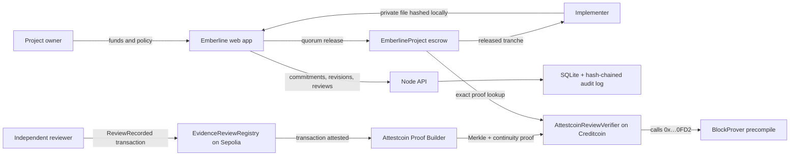
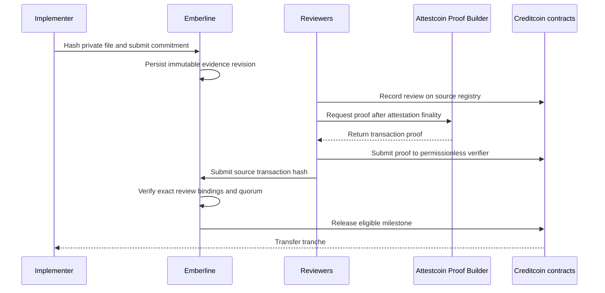

# Emberline architecture

## Two clearly separated experiences

The public guided workspace is a session-scoped application sandbox. It creates synthetic application records so a visitor can experience the evidence, review, quorum, and release flow without a wallet or signup; those records have no monetary value and are not public blockchain transactions. The live Attestcoin sample is separate and links the real Sepolia source events, Creditcoin proof registrations, Emberline review calls, and testnet escrow release.

## Trust boundaries

- Evidence files remain with the implementer. The browser calculates SHA-256 locally and sends only the commitment and a non-sensitive label.
- The API authenticates actor roles with server-side bearer-token hashes. Browser-supplied roles are never trusted.
- Review proofs are submitted permissionlessly. The immutable source-chain key, source registry, and BlockProver address define the verification boundary.
- The proven successful receipt must contain exactly one correctly encoded `ReviewRecorded` event from the configured registry.
- A rejection disputes the current revision. A replacement creates a new immutable revision without deleting prior evidence or reviews.
- The application audit chain detects both broken links and modified event contents.
- Blockchain verification proves the approval process and commitment binding; it does not independently prove a physical-world claim.

## Release sequence

